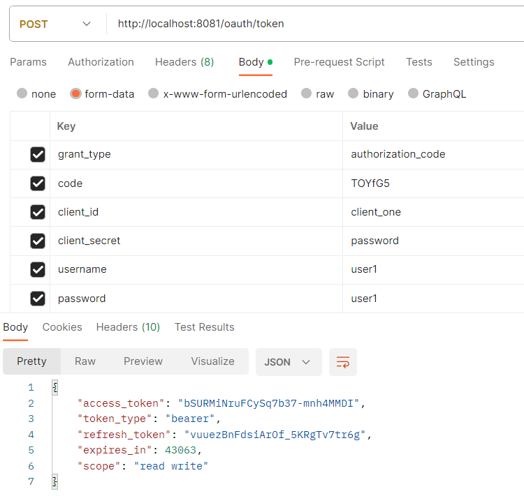
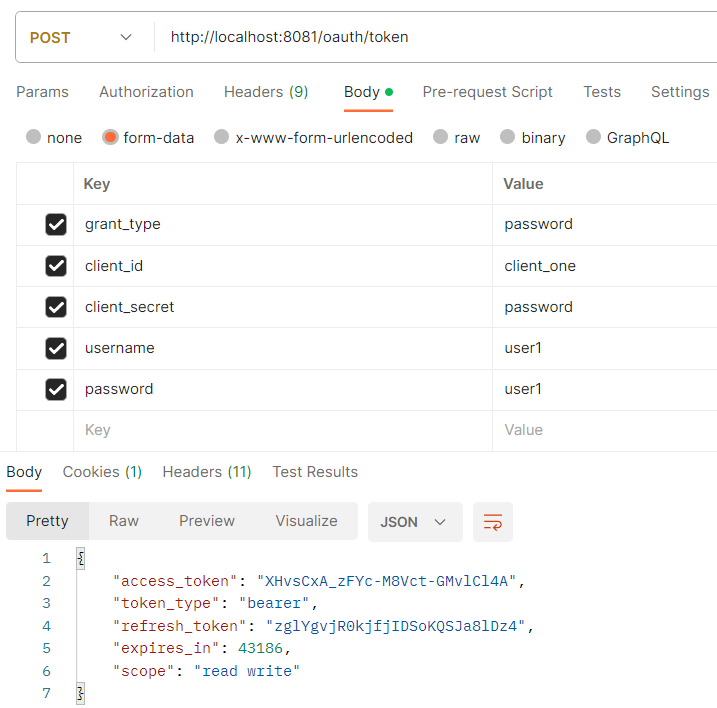
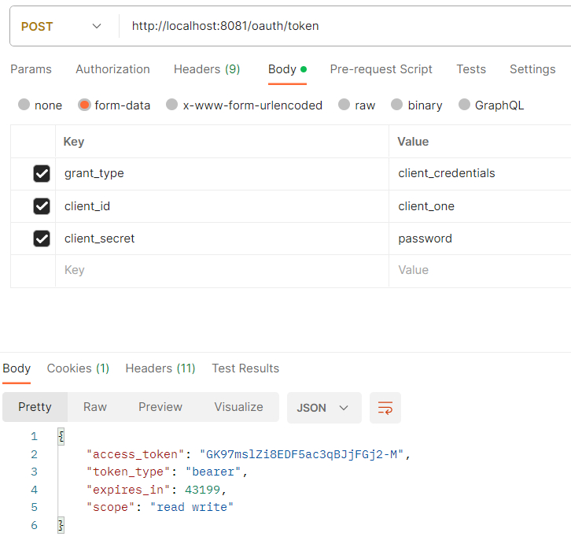
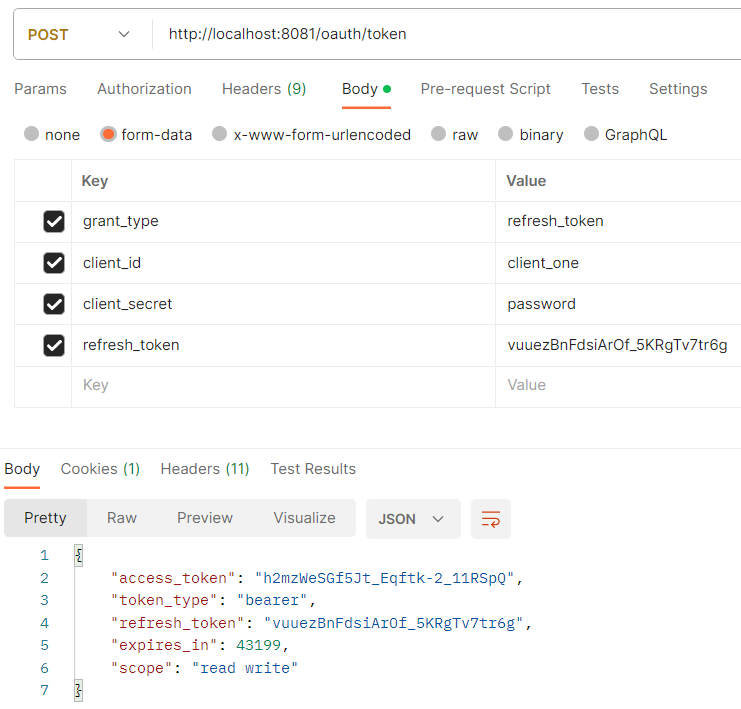

# security_oauth
spring-boot-starter-security 和spring-security-oauth2 有相容性問題
1. @EnableAuthorizationServer/@EnableResourceServer is deprecated，找不到替代方案
2. 若將server 端WebSecurityConfig 配置方式升級，則無法啟動Found WebSecurityConfigurerAdapter as well as SecurityFilterChain. Please select just one.，需維持舊方式extends WebSecurityConfigurerAdapter

## oauth_resource
僅提供資源
OauthResourceConfig：指定token的持久化策略、指定不同請求方式訪問資源所需要的權限

## oauth_server
驗證、頒發授權碼、頒發token
OauthServerConfig：指定客戶端登錄資料來源、檢測token的策略、授權信息保存策略
WebSecurityConfig：基本驗證授權

官方提供的schema.sql (在此省略ClientDetails) mysql中以BLOB代替LONGVARBINARY
```
create table oauth_client_details (
  client_id VARCHAR(256) PRIMARY KEY,
  resource_ids VARCHAR(256),
  client_secret VARCHAR(256),
  scope VARCHAR(256),
  authorized_grant_types VARCHAR(256),
  web_server_redirect_uri VARCHAR(256),
  authorities VARCHAR(256),
  access_token_validity INTEGER,
  refresh_token_validity INTEGER,
  additional_information VARCHAR(4096),
  autoapprove VARCHAR(256)
);

create table oauth_client_token (
  token_id VARCHAR(256),
  token LONGVARBINARY,
  authentication_id VARCHAR(256) PRIMARY KEY,
  user_name VARCHAR(256),
  client_id VARCHAR(256)
);

create table oauth_access_token (
  token_id VARCHAR(256),
  token LONGVARBINARY,
  authentication_id VARCHAR(256) PRIMARY KEY,
  user_name VARCHAR(256),
  client_id VARCHAR(256),
  authentication LONGVARBINARY,
  refresh_token VARCHAR(256)
);

create table oauth_refresh_token (
  token_id VARCHAR(256),
  token LONGVARBINARY,
  authentication LONGVARBINARY
);

create table oauth_code (
  code VARCHAR(256), authentication LONGVARBINARY
);

create table oauth_approvals (
	userId VARCHAR(256),
	clientId VARCHAR(256),
	scope VARCHAR(256),
	status VARCHAR(10),
	expiresAt TIMESTAMP,
	lastModifiedAt TIMESTAMP
);


-- customized oauth_client_details table
create table ClientDetails (
  appId VARCHAR(256) PRIMARY KEY,
  resourceIds VARCHAR(256),
  appSecret VARCHAR(256),
  scope VARCHAR(256),
  grantTypes VARCHAR(256),
  redirectUrl VARCHAR(256),
  authorities VARCHAR(256),
  access_token_validity INTEGER,
  refresh_token_validity INTEGER,
  additionalInformation VARCHAR(4096),
  autoApproveScopes VARCHAR(256)
);
```
## 測試
### 授權碼模式
http://localhost:8081/oauth/authorize?response_type=code&client_id=client_one
此範例配置的客戶端資訊存儲在oauth_client_details中，client_id='client_one', resource_ids='emp_api', client_secret='password', scope='read,write', authorized_grant_types='authorization_code,implicit,password,client_credentials,refresh_token', web_server_redirect_uri='http://example', autoapprove=false
1. 跳轉到SpringSecurity 登入頁面，登入成功後需再給定操作資源的權限
2. Authorize後跳轉到回調網址並取得授權碼，此範例是`http://example/?code={code}`
3. 利用授權碼取得token，此處username/password 是可選的

4. 在request header 攜帶token訪問資源網址、此範例是`http://localhost:8082/emps?access_token={token}` (GET)，或是`http://localhost:8082/emps` 並夾帶header Authorization=Bearer {token}

### 簡化模式
http://localhost:8081/oauth/authorize?response_type=token&client_id=client_one
1. 跳轉到SpringSecurity 登入頁面，登入成功後需再給定操作資源的權限
2. Authorize後跳轉到回調網址並取得token，此範例是`http://example/#access_token={token}&token_type=bearer&expires_in=42679&scope=read%20write`
3. 在request header 攜帶token訪問資源網址

### 密碼模式
1. 取得token

2. 在request header 攜帶token訪問資源網址

### 客戶端模式
1. 取得token，此模式無須經過資源owner授權、也不需要refresh token

2. 在request header 攜帶token訪問資源網址

### refresh token
由於授權碼只能使用一次，若想省略授權動作再次取得access token，需用此方式
http://localhost:8081/oauth/authorize?response_type=code&client_id=client_one
1. 跳轉到SpringSecurity 登入頁面，登入成功後需再給定操作資源的權限
2. Authorize後跳轉到回調網址並取得授權碼，此範例是`http://example/?code={code}`
3. 利用授權碼取得token，此處username/password 是可選的

4. 攜帶refresh token 取得access token
