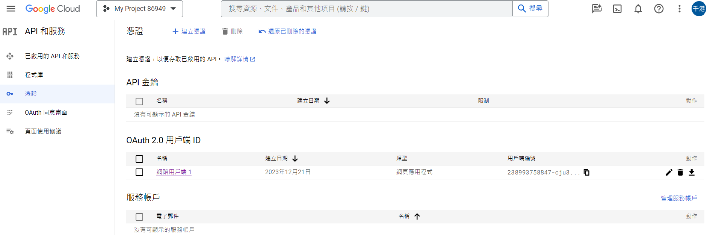
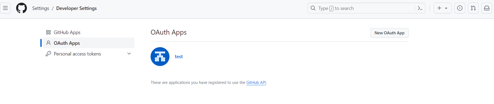

# security_thirdPartyLogin

config配置：登入登出行為

thymeleaf：自製登入頁

.yml：配置第三方登入資訊client-id、client-secret

## 第三方登入
google：https://console.developers.google.com/

github：https://github.com/settings/developers
